# Mini SQL Compiler - Architecture and Flow Diagrams

This document provides a comprehensive visual representation of the three-phase compilation process using Mermaid diagrams.

---

## Table of Contents
1. [Overall Compilation Flow](#overall-compilation-flow)
2. [Phase 01: Lexical Analysis](#phase-01-lexical-analysis)
3. [Phase 02: Syntax Analysis](#phase-02-syntax-analysis)
4. [Phase 03: Semantic Analysis](#phase-03-semantic-analysis)
5. [Data Flow Between Phases](#data-flow-between-phases)
6. [Error Handling Flow](#error-handling-flow)
7. [Symbol Table Management](#symbol-table-management)

---

## Overall Compilation Flow


---

## Phase 01: Lexical Analysis

### Lexical Analysis Process Flow


### DFA State Machines


---

## Phase 02: Syntax Analysis

### Syntax Analysis Process Flow

```mermaid
flowchart TD
    Input[Token Stream] --> InitParser[Initialize Parser<br/>pos = 0, errors = []]
    InitParser --> ParseQuery[parse_query]
    
    ParseQuery --> CheckToken{More Tokens?}
    CheckToken -->|No| Done[Return Parse Tree]
    CheckToken -->|Yes| ParseStmt[parse_statement]
    
    ParseStmt --> StmtType{Statement Type?}
    
    StmtType -->|CREATE| ParseCreate[parse_create_stmt]
    StmtType -->|INSERT| ParseInsert[parse_insert_stmt]
    StmtType -->|SELECT| ParseSelect[parse_select_stmt]
    StmtType -->|UPDATE| ParseUpdate[parse_update_stmt]
    StmtType -->|DELETE| ParseDelete[parse_delete_stmt]
    StmtType -->|Unknown| SyntaxErr[Syntax Error<br/>Unexpected Statement]
    
    ParseCreate --> CreateTree[Build CREATE Tree<br/>- Table Name<br/>- Column Definitions<br/>- Data Types]
    ParseInsert --> InsertTree[Build INSERT Tree<br/>- Table Name<br/>- Value List]
    ParseSelect --> SelectTree[Build SELECT Tree<br/>- Column List<br/>- Table Name<br/>- WHERE Clause]
    ParseUpdate --> UpdateTree[Build UPDATE Tree<br/>- Table Name<br/>- SET Clause<br/>- WHERE Clause]
    ParseDelete --> DeleteTree[Build DELETE Tree<br/>- Table Name<br/>- WHERE Clause]
    
    CreateTree --> MatchSemi[Match SEMICOLON]
    InsertTree --> MatchSemi
    SelectTree --> MatchSemi
    UpdateTree --> MatchSemi
    DeleteTree --> MatchSemi
    
    SyntaxErr --> PanicMode[Panic Mode Recovery<br/>Skip to next SEMICOLON]
    PanicMode --> AddError[Add to Error List]
    
    MatchSemi --> AddNode[Add Statement Node<br/>to Parse Tree]
    AddError --> CheckToken
    AddNode --> CheckToken
    
    Done --> Output[Output:<br/>- Parse Tree<br/>- Syntax Errors]
    
    style Input fill:#e1f5e1
    style Output fill:#c8e6c9
    style SyntaxErr fill:#ffcdd2
    style AddError fill:#ffcdd2
```

### Parse Tree Structure


---

## Phase 03: Semantic Analysis

### Semantic Analysis Process Flow

```mermaid
flowchart TD
    Input[Parse Tree] --> InitAnalyzer[Initialize Semantic Analyzer<br/>symbol_table = {}<br/>errors = []]
    InitAnalyzer --> Traverse[Traverse Parse Tree]
    
    Traverse --> NodeType{Node Type?}
    
    NodeType -->|CreateStmt| AnalyzeCreate[Analyze CREATE TABLE]
    NodeType -->|InsertStmt| AnalyzeInsert[Analyze INSERT]
    NodeType -->|SelectStmt| AnalyzeSelect[Analyze SELECT]
    NodeType -->|UpdateStmt| AnalyzeUpdate[Analyze UPDATE]
    NodeType -->|DeleteStmt| AnalyzeDelete[Analyze DELETE]
    NodeType -->|Other| Continue[Continue Traversing]
    
    AnalyzeCreate --> CheckRedecl{Table Already<br/>Exists?}
    CheckRedecl -->|Yes| ErrRedecl[Semantic Error:<br/>Table Redeclaration]
    CheckRedecl -->|No| ValidTypes{Valid Data<br/>Types?}
    ValidTypes -->|No| ErrType[Semantic Error:<br/>Invalid Data Type]
    ValidTypes -->|Yes| AddTable[Add Table to<br/>Symbol Table]
    
    AnalyzeInsert --> CheckTable1{Table<br/>Exists?}
    CheckTable1 -->|No| ErrNoTable1[Semantic Error:<br/>Table Not Found]
    CheckTable1 -->|Yes| CheckCount{Value Count<br/>= Column Count?}
    CheckCount -->|No| ErrCount[Semantic Error:<br/>Count Mismatch]
    CheckCount -->|Yes| CheckTypes{Value Types<br/>Match?}
    CheckTypes -->|No| ErrTypeMismatch[Semantic Error:<br/>Type Mismatch]
    CheckTypes -->|Yes| AnnotateInsert[Annotate Values<br/>with Types]
    
    AnalyzeSelect --> CheckTable2{Table<br/>Exists?}
    CheckTable2 -->|No| ErrNoTable2[Semantic Error:<br/>Table Not Found]
    CheckTable2 -->|Yes| CheckCols{Columns<br/>Exist?}
    CheckCols -->|No| ErrNoCols[Semantic Error:<br/>Column Not Found]
    CheckCols -->|Yes| AnalyzeWhere1[Analyze WHERE Clause<br/>Type Compatibility]
    AnalyzeWhere1 --> AnnotateSelect[Annotate Columns<br/>with Types]
    
    AnalyzeUpdate --> CheckTable3{Table<br/>Exists?}
    CheckTable3 -->|No| ErrNoTable3[Semantic Error:<br/>Table Not Found]
    CheckTable3 -->|Yes| CheckUpdateCol{Column<br/>Exists?}
    CheckUpdateCol -->|No| ErrNoCol[Semantic Error:<br/>Column Not Found]
    CheckUpdateCol -->|Yes| CheckUpdateType{Value Type<br/>Matches?}
    CheckUpdateType -->|No| ErrUpdateType[Semantic Error:<br/>Type Mismatch]
    CheckUpdateType -->|Yes| AnalyzeWhere2[Analyze WHERE Clause]
    AnalyzeWhere2 --> AnnotateUpdate[Annotate Update<br/>with Types]
    
    AnalyzeDelete --> CheckTable4{Table<br/>Exists?}
    CheckTable4 -->|No| ErrNoTable4[Semantic Error:<br/>Table Not Found]
    CheckTable4 -->|Yes| AnalyzeWhere3[Analyze WHERE Clause]
    AnalyzeWhere3 --> AnnotateDelete[Annotate Delete<br/>with Types]
    
    ErrRedecl --> AddErr[Add Error to List]
    ErrType --> AddErr
    ErrNoTable1 --> AddErr
    ErrCount --> AddErr
    ErrTypeMismatch --> AddErr
    ErrNoTable2 --> AddErr
    ErrNoCols --> AddErr
    ErrNoTable3 --> AddErr
    ErrNoCol --> AddErr
    ErrUpdateType --> AddErr
    ErrNoTable4 --> AddErr
    
    AddTable --> MoreNodes{More Nodes?}
    AnnotateInsert --> MoreNodes
    AnnotateSelect --> MoreNodes
    AnnotateUpdate --> MoreNodes
    AnnotateDelete --> MoreNodes
    Continue --> MoreNodes
    AddErr --> MoreNodes
    
    MoreNodes -->|Yes| Traverse
    MoreNodes -->|No| CheckErrors{Errors<br/>Found?}
    
    CheckErrors -->|Yes| ErrorOutput[Output:<br/>- Error List<br/>- Symbol Table<br/>Status: FAILED]
    CheckErrors -->|No| SuccessOutput[Output:<br/>- Symbol Table Dump<br/>- Annotated Parse Tree<br/>Status: SUCCESS]
    
    ErrorOutput --> End[End]
    SuccessOutput --> End
    
    style Input fill:#e1f5e1
    style SuccessOutput fill:#c8e6c9
    style ErrorOutput fill:#ffcdd2
    style ErrRedecl fill:#ffcdd2
    style ErrType fill:#ffcdd2
    style ErrNoTable1 fill:#ffcdd2
    style ErrCount fill:#ffcdd2
    style ErrTypeMismatch fill:#ffcdd2
    style ErrNoCols fill:#ffcdd2
    style End fill:#e1f5e1
```

### Type Checking Flow

```mermaid
flowchart TD
    Start[Value or Operand] --> InferType[Infer Type from Token]
    
    InferType --> CheckFormat{Token Format?}
    CheckFormat -->|'...'| TextType[Type: TEXT]
    CheckFormat -->|Contains '.'| FloatType[Type: FLOAT]
    CheckFormat -->|Integer| IntType[Type: INT]
    
    TextType --> LookupExpected[Lookup Expected Type<br/>from Symbol Table]
    FloatType --> LookupExpected
    IntType --> LookupExpected
    
    LookupExpected --> Compare{Types<br/>Compatible?}
    
    Compare -->|Exact Match| Success[ Type Valid]
    Compare -->|INT ↔ FLOAT| NumCompat[ Numeric Compatible]
    Compare -->|Mismatch| TypeError[ Type Mismatch Error]
    
    Success --> Annotate[Annotate Node<br/>with Type Info]
    NumCompat --> Annotate
    TypeError --> ReportError[Report Semantic Error<br/>with Line & Column]
    
    Annotate --> Done[Continue Analysis]
    ReportError --> Done
    
    style Start fill:#e1f5e1
    style Success fill:#c8e6c9
    style NumCompat fill:#c8e6c9
    style TypeError fill:#ffcdd2
    style ReportError fill:#ffcdd2
```



---

## Data Flow Between Phases


---

## Error Handling Flow


### Error Message Format


**Example Error Messages:**

```
Lexical Error: Unexpected character '@' at 5:12
Syntax Error at 7:15 - Expected 'INTO', found 'FORM'
Semantic Error: Table 'Users' not found (Line 10, Column 14)
Semantic Error: Type mismatch at line 15, position 24. Column 'age' is defined as INT, but a TEXT literal was provided for insertion (Line 15, Column 24)
```

---

## Symbol Table Management

### Symbol Table Structure


### Symbol Table Operations


---

## Complete Compilation Sequence


---

## Module Interactions


---

## Summary

This architecture document provides complete visual representations of:

- **Overall Flow**: Three-phase compilation process
- **Phase 01**: DFA-based lexical analysis with token generation
- **Phase 02**: Recursive descent parsing with parse tree construction
- **Phase 03**: Symbol table management and semantic verification
- **Data Flow**: How information passes between phases
- **Error Handling**: Comprehensive error detection and reporting
- **Symbol Table**: Structure and operations for metadata management

