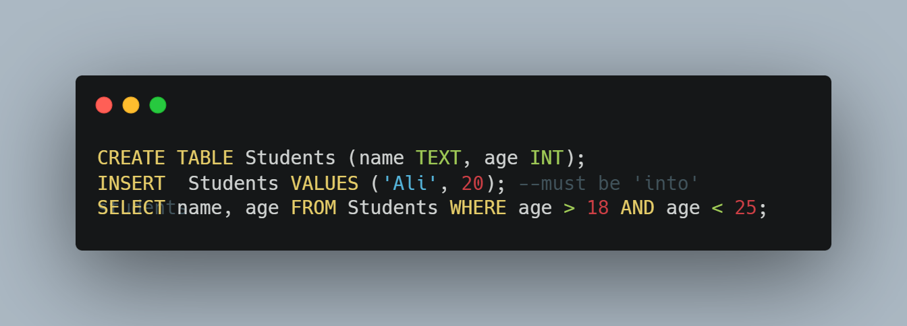
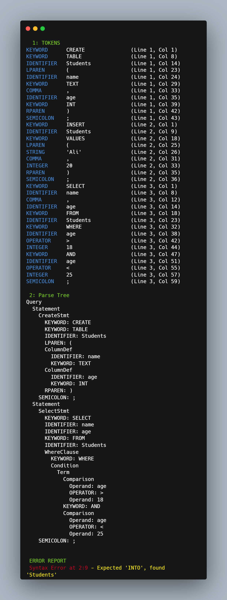

# SQL Compiler (Lexical & Syntax Analyzer)

A Python-based **SQL Compiler** that consists of two main phases:
1. **Lexical Analyzer (Lexer):** Tokenizes SQL code using **Deterministic Finite Automata (DFA)** without relying on Regular Expressions.
2. **Syntax Analyzer (Parser):** A **Recursive Descent Parser** that validates the token stream against a Context-Free Grammar (CFG) and generates a hierarchical **Parse Tree**.

The tool features **Colorized CLI Output** for better readability and implements **Panic Mode Recovery** to handle syntax errors gracefully.

---

## Features

### Phase 1: Lexical Analysis
* **No Regex:** Character classification and tokenization are built purely using native logic and DFAs.
* **DFA-Based:** dedicated DFAs for Identifiers, Numbers (Integers & Floats), Strings, and Operators.
* **Case Sensitivity:** Distinguishes between `SELECT` (Keyword) and `select` (Identifier).
* **Robust Handling:** Manages comments (`--` and `## ##`) and string literals.

### Phase 2: Syntax Analysis
* **Recursive Descent Parser:** Implements a top-down approach to validate SQL grammar.
* **Parse Tree Generation:** visualization of the grammatical structure of the query.
* **Supported Statements:** `CREATE`, `INSERT`, `SELECT`, `UPDATE`, `DELETE`.
* **Complex Clauses:** Handles `WHERE` clauses with Boolean logic (`AND`, `OR`, `NOT`) and comparisons.
* **Error Recovery:** Uses "Panic Mode" to skip invalid tokens until a semicolon is found, allowing the parser to continue checking subsequent statements.

---

## Project Overview

| Member | Module | Description |
| :----: | :----------------------------------------- | :----------------------------------------------------------------------------------- |
| **1** | [`dfa_definitions.py`](dfa_definitions.py) | **(No Regex)** Character classification and DFA transitions for all token types. |
| **2** | [`dfa_runner.py`](dfa_runner.py) | Generic DFA engine that simulates transitions and recognizes tokens. |
| **3** | [`lexer.py`](lexer.py) | Main lexical logic: orchestrates DFAs, handles whitespace/comments/strings. |
| **4** | [`parser.py`](parser.py) | **(New)** Recursive Descent Parser that builds the Parse Tree and handles syntax errors. |
| **5** | [`main.py`](main.py) | Entry point: Integrates Lexer & Parser, provides **Colorized Output**. |

---

## Repository Structure

```text
MiniSQLCompiler/
│
├── dfa_definitions.py      # DFA definitions & classify_char (No Regex)
├── dfa_runner.py           # Generic DFA runner
├── lexer.py                # Tokenization logic
├── parser.py               # Syntax Analysis & Parse Tree Nodes
├── main.py                 # Main execution & Colorized Reporting
│
├── samples/
│   └── test_1.sql          # Example SQL input file
│
├── README.md
└── requirements.txt
````

-----

## Installation

### Clone the Repository

```bash
git clone [https://github.com/MohamedElsadany56/MiniSQLCompiler.git](https://github.com/MohamedElsadany56/MiniSQLCompiler.git)
cd MiniSQLCompiler
```

### (Optional) Create a Virtual Environment

```bash
python -m venv venv
source venv/bin/activate     # On Linux/Mac
venv\Scripts\activate        # On Windows
```

### Install Requirements

```bash
pip install -r requirements.txt
```

*(Note: this project uses standard libraries like `sys` and `os`. No heavy external dependencies required.)*

-----

## Usage

Run the compiler by passing an SQL file as an argument:

```bash
python main.py samples/test_1.sql
```

### Example Input (`samples/test_1.sql`)




-----

## Context-Free Grammar (CFG)

The parser implements the following grammar rules:

```ebnf
Query        ::= Statement { Statement }
Statement    ::= (CreateStmt | InsertStmt | SelectStmt | UpdateStmt | DeleteStmt) ";"

CreateStmt   ::= "CREATE" "TABLE" IDENTIFIER "(" ColumnDefList ")"
InsertStmt   ::= "INSERT" "INTO" IDENTIFIER "VALUES" "(" ValueList ")"
SelectStmt   ::= "SELECT" SelectList "FROM" IDENTIFIER [WhereClause]
UpdateStmt   ::= "UPDATE" IDENTIFIER "SET" IDENTIFIER "=" Value [WhereClause]
DeleteStmt   ::= "DELETE" "FROM" IDENTIFIER [WhereClause]

WhereClause  ::= "WHERE" Condition
Condition    ::= Term { "OR" Term }
Term         ::= Factor { "AND" Factor }
Factor       ::= "NOT" Factor | "(" Condition ")" | Comparison
Comparison   ::= Operand OPERATOR Operand
```

-----

## Algorithm Summary

1.  **Lexical Analysis (Phase 1):**

      * Reads the input file.
      * Classifies characters manually (no Regex).
      * Runs DFAs to generate a stream of tokens (`KEYWORD`, `IDENTIFIER`, `INTEGER`, `FLOAT`, etc.).

2.  **Syntax Analysis (Phase 2):**

      * Receives the list of tokens.
      * Applies **Recursive Descent** logic based on the CFG.
      * Constructs a **Parse Tree** of `ParseNode` objects.
      * If a syntax error occurs, it reports the error (Red) and suggestions (Yellow), then consumes tokens until a `;` is found (**Panic Mode Recovery**) to parse the next statement.

-----

## Contributors

| Name | Role | Module |
| :--- | :--- | :--- |
| Mohamed Goma (Elsadany) | DFA Definitions, No-Regex Logic | `dfa_definitions.py`/ `parser.py` |
| Mohamed Hassan | DFA Runner Implementation | `dfa_runner.py`/ `parser.py` |
| Mostafa Adel | Tokenizer Logic | `lexer.py`/ `parser.py` |
| Ziad Hamada | Integration, CLI Colors, Parser | `main.py` / `parser.py` |

-----

## License

This project is released under the **MIT License**.
Feel free to modify and distribute with credit to the contributors.
